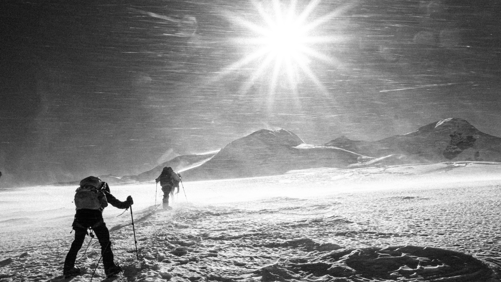

I'm finding vignettes the easiest to write as of now, so I'll give you the chronology of the past few months here for context. The stories below might jump around a bit, but here's what went down:

End of October - Beginning of November: Spent 8 days at a monastery in the village of Panggom during a 10-day long puja ceremony.

Early November: Stayed for a week at Karma's parent's house, then trekked over the Chatrwa La back to Lukla to meet the members of the climbing course

Mid November - Mid December: Nepal Alpine Climbing Course! Climbed Mera peak

Mid December - New Year's: Went to Chittiwan, Pokhara, and trekked the Annapurna Circuit with Lindsay

New Year's - Now: Chilling in Thailand before a 10 day meditation course in Kathmandu.

As always, check out the gallery for more pictures!

# Ceremony

From the outside, a puja is a stolid, intimidating affair. From 5:30 in the morning until dinner, muttered prayers resound through loudspeakers and echo down into the village of Panggom as thirty monks gather in the main hall of the Tashi Sangag Chholing Monastery. Each moment is draped in ceremony: young monks build and place effigies, others swing pots of burning incense to purify the room, still others carefully place offerings at the feet of massive statues to Buddha, Avalokitsvara, and Guru Padmasambhava. Endless moments pass in trance-like concentration as the chanting mounts to a crescendo, until it all at once dissolves into the clamorous exhaltation of thundering horns, flutes, cymbals, and the beating of the drum.

After four days at the monastery, I had only just summoned up the courage to take part in the proceedings. Taking a deep breath, I took off my shoes and entered the hall. Before the two head monks of the village and the Lord Buddha glittering in gold, I paid my respects. Three times I raised my pressed palms to my forehead, brought them down to my chest, then knelt and touched my head to the floor. I heard giggling from the young novices and flushed red; I'd made a mistake. I was supposed to touch my hands to my chin, too. I looked around, but if any others had noticed my blunder, no one seemed to care. Lhakpa Kaji, the youngest of the novices and ever the trouble maker, was paying his own respects, and as he bowed he kept stealing glances at me and giggling. I took my camera out to photograph him. Seeing the camera, Serzhang, the teacher of the monastery, motioned for me to take his picture too. As he grinned, straightened his back, and puffed up for his portrait, I finally realized that this wasn't all so serious, that I would be accepted here and loved for who I was. The little monks shuffled over to give me a seat, and I settled into the room's energy of peace and contentment. I felt at home as the chanting built to its peak, joy as the instruments thundered through the hall once again.

# Gharo Chha, Nepal Ma

The walk from Sibuje to Pema's home and lodge at Physang Kharka was shorter than I had hoped it would be. Having spent the previous two weeks completely sedentary, I felt I had gone soft. Without trekking, my legs felt weak and stiff. Without climbing, my hands too supple. I gave them a look over. No calluses, no cuts... I felt far too much like the city boy I was here to escape. I sighed as Pema brought me an entire pitcher of fresh mint tea. We hadn't seen each other since he dropped me off in Panggom, and he obviously wanted to spoil me.

As I sipped my tea, I looked down the hill where Pema had gone to join the workers he hired to develop his land. They were breaking ground to build a new level of terraced field, as well as building the foundation for the guest rooms he has planned to add to his lodge. I recognized one of them as the porter who brought food to Karma's parent's house for the ceremony they hosted just a few days earlier. After a short discussion, Pema hopped right in to work, picking up a khukri (Nepali machete) to cut away foliage before the others broke up the soil. I felt a pang of disgust at myself, the only one relaxing, while even the owner of the house labored away. So I put down the tea and walked over.

Predicatably, Pema wouldn't give me a machete. Probably a good choice. Instead I picked up a metal pike and drove it clumsily in to the ground to break up roots and rocks before the others used hoes to shape the field. In less than an hour, we had formed the entire perimeter of the terrace and I had absolutely ravaged my hands. I counted 9 blisters in total, two of them blood blisters and two others already ripped open by the coarse metal as my hands slid over it. I felt embarrassed by my weakness as the porter from earlier looked my hands over and cooed as he remarked how they must hurt. Taking my hands in his, he ran his thumbs over my blisters and I was instantly transported.

His hands felt like rawhide, tanned in the high mountain sun and weathered through a lifetime of toil in the dirt. They felt like solid granite, like rock left in the ground because they were too hard to break up to create masonry blocks. His hands spoke of the stories he had told me as we worked, of a village destitute and crumbling, its men wandering for any work they could find because their fields had gone dry, braving the harsh winter nights with bare feet and no more than a thin sweater since they could not even buy clothing. They spoke of a generation of children whose families could not afford to finish their education, destined to wander too. His hands spoke of these stories and told me they were true. As they, so hardened themselves, held mine so gently to ease my pain, I thought only of how opposite the situation truly was. How far removed was I from the hardship this man has endured his entire life, how lucky was I to share his path for even an hour, knowing I could return to my privilege any time I wanted.

"Gahro chha, Nepal ma (It's hard in Nepal)" is a refrain every mountain dweller says here. As much as 75% of Nepal's population works in agriculture, and of that group 68% rely on subsistence farming as their main source of food. Yet without basic infrastructure like roads and irrigation systems, most are unable to even meet their own nutritional needs and have no means of bringing goods to market. As a result, 28% of Nepal's rural population is multi-dimensionally poor, wanting most for food, housing materials, and education. When there's no rain, there's no work, so people like these men take to the trails for whatever employment they can find. These people possess tremendous strength and resolve, but it is strength borne of a hardship I cannot begin to imagine.

My hands as torn as they were, I took up more the more fitting task of lifting massive stones onto the other mens' backs for them to haul up to the construction site, where they were hammered into crude bricks for the foundation's construction. At the end of the day, we huddled close and shared copious cups of the local millet alcohol called chang, and I tried my best to understand their stories of toil and life in the mountains. Everyone except me slept together on the floor of the living room. When I rose the next morning, work had already resumed.

# High Camp

The highest forecasted winds of the season rocked a flimsy tent in Mera Peak's high camp, 19 thousand feet above sea level. As my alarm rung at 3:30 am, my tentmate Travis, a former Special Ops weapon specialist, contemplated the integrity of the structure and whether or not it was safe to leave.

"I'm scared it's going to blow us off the cliff," he said as he laced up his boots. The camp was located in a precarious position, with a crumbling rock pile above and a likely death fall below. It was probably placed there to better protect climbers from the wind, which it was absolutely failing at today.

"Nah it's not that bad man," I assured him, "the tent just makes it seem worse than it is. I went out earlier and was fine." He shrugged and opened the door, and no sooner did he step out than a gust came and knocked the whole thing sideways. Thinking quickly, Travis jumped back inside and flung himself against the back wall as the mountain continued trying to rid itself of us.

"It's not that bad, huh?!" He stared at me with a mixture of fear and amusement, a funny look to get from a dude who's spent more years in active combat zones than I've spent out of high school. I just cackled.

Unable to leave, I tried shouting at Pasang Dawa for help, "our tent is broken! We're going to fall! Help!" Apparently desperate wails in broken Nepali don't translate well over gale force winds, because he acknowledged me and responded by ducking into the mess tent and coming out with a fresh cup of tea.

"God damnit Pasang Dawa I don't need tea I need you to fix the fucking tent," I cursed him under my breath and laughed as he walked over, delicately stepping over the uneven ground so as not to spill the contents of the mug. He offered it to me through the door flap and gave me a sincere, oblivious smile. I sighed and told him he might as well get one for Travis too.

# Suffer Well

"Please, have more porridge!" Sonam seemed insulted that I had hardly been able to finish my breakfast, and only had one cup of tea. I had a long walk ahead that day and with the amount I had eaten, he insisted I would get hungry. He was right, of course, but I could hardly bear thinking about eating anything else. Apparently, in addition to the wonderful memories the Panggom monastery gave to me, it also gave me a stomach parasite whose symptoms come in waves of increasing intensity over the course of weeks. I didn't want to tell Sonam for fear he might think his food was the cause, but last night what I thought was a touch of indigestion turned into projectile vomiting the entire contents of my stomach. Feeling weak and feverish, I smiled and told Sonam I would be fine, thanked him for the extra biscuits he gave me, and set off while trying my best to conceal my condition. As soon I was out of sight of the house, I practically collapsed. Over the next two days I would have to walk, alone for the first time since I had come to Nepal, 12 miles, ascend 5900 feet, and descend 6600 feet over the 15 thousand foot high Chatrwa La mountain pass in order to reach Lukla and the nearest hospital where I could get medication for my illness. I had absolutely no idea how I was going to do it in my condition, but I knew for sure that it was going to suck.

--

A month later, 20 thousand feet high on the summit push of Mera Peak, Karma finally let our rope team sit for a true break. I crumbled to the snow and feebly unwrapped the Snickers bar I had been warming in my jacket pocket. My heart rate slowed, allowing my oxygen-starved brain even less of the blood it craved, and the capillaries in my head responded by swelling even further. As I hastily swallowed the candy, I felt every labored heartbeat pulsate in my skull. It didn't even taste good.

I looked around; everyone was floundering. Diem and Travis, the other American students, had only just recovered from stomach illnesses similar to the one I had on the Chatrwa La, and altitude was ravaging the heads and lungs of every climber. Three of the Nepali students had severe Acute Mountain Sickness (AMS), and were given medicine after they began vomiting at high camp. Last night, Mingma had to evacuate one of our porters after he started acting erratically, a telltale sign of High Altitude Cerebral Edema (HACE), a progression of AMS which is almost certainly fatal if untreated. I had opted not to take medication, and last night's mild headache had become almost debilitating. Everyone was floundering, that is, except Karma, who possesses a genetic gift that allows him to flout altitude. He was cheery as ever - he almost looked like he'd break out into dance.

"Okay!" Karma grinned as he threw his pack on, signaling the end of our break. I actually snarled at him.

--

"How far have we gone?" Lindsay gasped the question out and sat on a flat rock under a string of brightly colored prayer flags, 14 thousand feet up the trail to Ice Lake on the Annapurna Circuit.

"We made 1000 feet in an hour. You're kicking ass baby." I sat next to her and admired our panoramic view of the terrible Annapurna massif, its windswept summit ridges again as high above us as we were above sea level. The air whistled as two Steppe Eagles made their rounds just overhead.

Although Lindsay had escaped Nepal's trademark stomach ailments, her sinuses were not so lucky. In Lower Pisang three days before, she developed congestion that turned to a persistent cough and feverish weakness. We feared it was Covid, but without tests we had no way of confirming our suspicion. Regardless, she was in pain, and her condition had not improved even with an extra rest day at the fabulous Tilicho Hotel in Manang. Last night, I had given her an ultimatum. Manang was the terminus of the jeep road, and the last place on the circuit from which we could easily evacuate. We could either go down now, or we could go up. But going up entailed crossing the Thorong La, an almost 18 thousand foot high mountain pass that, having just come from near sea level in Chittiwan, we were absolutely not prepared for. To acclimatize, we would have to train our bodies to handle altitude by ascending 4,000 feet to Ice Lake and descending again to Manang. And we'd have to do it immediately, as the weather forecasts predicted a storm front in only a few days that would bar us from even attempting the pass.

From my small pack I handed Lindsay her water, and she gulped it down. Despite her illness, she had decided to try. We got up and resumed our march, making it through the next step, the next hour. In silence, I beamed with pride.

--

It's ironic and unflattering, but the suffering we experience as visitors to the Himalaya is not so much an unintended side effect as it is... the whole point. We think we're here to see the beauty of the mountains, but really we're here to take on a fraction of their hardship and just see if we can bear it. But unless you are pioneering new, committing routes on the highest peaks, the reality is that you will never even begin to approach the hardship borne every day by those that call this place home. So we come, and must recognize that we come, as students. And as students, we learn what we can bear and what we can't, and through perseverence tempered with knowledge and caution, we learn we can succeed.

